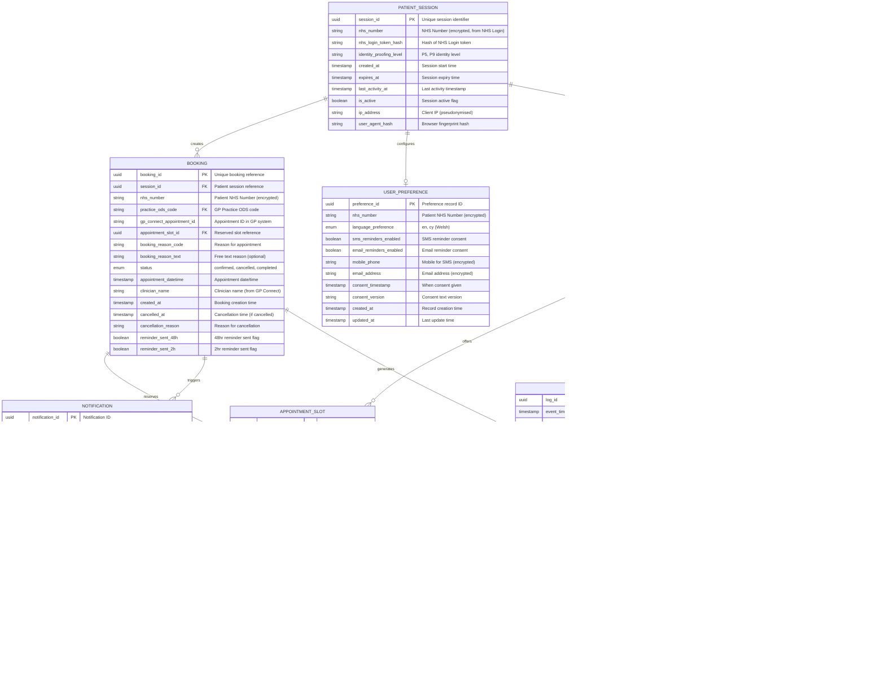

# Data Model: NHS Doctors Online Appointment System

> **Template Status**: Live | **Version**: 1.0.0 | **Command**: `/arckit.data-model`

## Document Control

| Field | Value |
|-------|-------|
| **Document ID** | ARC-001-DATA-v1.0 |
| **Document Type** | Data Model |
| **Project** | NHS Doctors Online Appointment System (Project 001) |
| **Classification** | OFFICIAL-SENSITIVE |
| **Status** | DRAFT |
| **Version** | 1.0 |
| **Created Date** | 2026-01-28 |
| **Last Modified** | 2026-01-28 |
| **Review Cycle** | Quarterly |
| **Next Review Date** | 2026-04-28 |
| **Owner** | Enterprise Architect, NHS Digital |
| **Reviewed By** | PENDING |
| **Approved By** | PENDING |
| **Distribution** | Project Team, NHS Digital, Clinical Safety Officer, Information Governance Lead, DPO |

## Revision History

| Version | Date | Author | Changes | Approved By | Approval Date |
|---------|------|--------|---------|-------------|---------------|
| 1.0 | 2026-01-28 | ArcKit AI | Initial creation from `/arckit.data-model` command | PENDING | PENDING |

---

## Executive Summary

### Overview

This data model defines the persistent data structures required for the NHS Doctors Online Appointment System. The model supports patient appointment booking, viewing, and cancellation through integration with NHS Spine (PDS), NHS Login, and GP Connect. All data handling complies with UK GDPR special category requirements for health data, NHS Data Security and Protection Toolkit (DSPT), and clinical safety standards (DCB0129/DCB0160).

The data model is intentionally minimal, following data minimisation principles. Patient demographics are retrieved from NHS Spine PDS at runtime and are not persisted locally except for essential booking records. The primary data store manages booking records, audit logs, user preferences, and notification states.

This model traces directly to Data Requirements from ARC-001-REQ-v1.0 and aligns with architecture principles in ARC-000-PRIN-v1.0, particularly Principle 7 (Patient Data Protection) and Principle 8 (Data Quality and Lineage).

### Model Statistics
- **Total Entities**: 8 entities defined (E-001 through E-008)
- **Total Attributes**: 68 attributes across all entities
- **Total Relationships**: 9 relationships mapped
- **Data Classification**:
  - 🟢 Public: 0 entities
  - 🟡 Internal: 1 entity (E-008: AppointmentType)
  - 🟠 Confidential: 4 entities (E-001, E-003, E-004, E-005)
  - 🔴 Restricted: 3 entities (E-002, E-006, E-007 - contain special category health data / PII)

### Compliance Summary
- **GDPR/DPA 2018 Status**: NEEDS_DPIA (special category health data processed)
- **PII Entities**: 5 entities contain personally identifiable information
- **Special Category Data**: Health appointment data (GDPR Article 9)
- **Data Protection Impact Assessment (DPIA)**: REQUIRED
- **Data Retention**: 8 years maximum (NHS Records Management Code)
- **Cross-Border Transfers**: NO (UK data residency mandatory)

### Key Data Governance Stakeholders
- **Data Owner (Business)**: NHS Digital Director of Digital Services - Accountable for data quality and usage
- **Data Steward**: Information Governance Lead - Responsible for data governance policies
- **Data Custodian (Technical)**: Database Operations Team - Manages data storage and security
- **Data Protection Officer**: NHS Digital DPO - Ensures privacy compliance
- **Clinical Safety Officer**: Approves data handling for clinical safety

---

## Visual Entity-Relationship Diagram (ERD)

**Diagram Notes**:
- **Cardinality**: `||` = exactly one, `o{` = zero or more, `|{` = one or more
- **Primary Keys (PK)**: Uniquely identify each record
- **Foreign Keys (FK)**: Reference other entities
- **NHS Number**: Always encrypted at rest using AES-256
- **Special Category Data**: Booking entity contains health appointment data

---

## Entity Catalog

### Entity E-001: PATIENT_SESSION

**Description**: Represents an authenticated patient session established via NHS Login. Sessions are short-lived and do not persist patient demographic data - demographics are retrieved from PDS for each session.

**Source Requirements**:
- FR-1: NHS Login Authentication
- NFR-SEC-1: Authentication requirements
- NFR-SEC-4: Audit Logging

**Business Context**: Sessions enable patients to book, view, and cancel appointments during an authenticated window. The session links to NHS Number from NHS Login but does not store patient demographics locally.

**Data Ownership**:
- **Business Owner**: Product Owner, NHS Digital - Accountable for session management
- **Technical Owner**: Security Team - Maintains session infrastructure
- **Data Steward**: Information Governance Lead - Enforces session data policies

**Data Classification**: CONFIDENTIAL (contains NHS Number reference)

**Volume Estimates**:
- **Initial Volume**: 0 records at go-live
- **Growth Rate**: +100,000 sessions per month
- **Peak Volume**: 3 million active sessions at peak
- **Average Record Size**: 0.5 KB

**Data Retention**:
- **Active Period**: Session lifetime (max 4 hours absolute timeout)
- **Archive Period**: 30 days in audit archive (for session correlation)
- **Total Retention**: 30 days then hard delete
- **Deletion Policy**: Hard delete after session expiry + 30 days

#### Attributes

| Attribute | Type | Required | PII | Description | Validation Rules | Default | Source Req |
|-----------|------|----------|-----|-------------|------------------|---------|------------|
| session_id | UUID | Yes | No | Unique session identifier | UUID v4 format | Auto-generated | FR-1 |
| nhs_number | VARCHAR(10) | Yes | Yes | Patient NHS Number from NHS Login | 10 digits, encrypted AES-256 | None | FR-1 |
| nhs_login_token_hash | VARCHAR(64) | Yes | No | SHA-256 hash of NHS Login token | Valid SHA-256 hash | None | FR-1 |
| identity_proofing_level | VARCHAR(5) | Yes | No | NHS Login identity level | P5, P9 | None | FR-1 |
| created_at | TIMESTAMP | Yes | No | Session start time | ISO 8601, UTC | NOW() | NFR-SEC-1 |
| expires_at | TIMESTAMP | Yes | No | Session expiry time | ISO 8601, UTC, created_at + 4 hours max | None | NFR-SEC-1 |
| last_activity_at | TIMESTAMP | Yes | No | Last user activity | ISO 8601, UTC | NOW() | NFR-SEC-1 |
| is_active | BOOLEAN | Yes | No | Session active flag | true/false | true | NFR-SEC-1 |
| ip_address | VARCHAR(45) | Yes | Yes | Client IP address (pseudonymised) | Valid IPv4/IPv6 | None | NFR-SEC-4 |
| user_agent_hash | VARCHAR(64) | No | No | Browser fingerprint hash | Valid SHA-256 hash | NULL | NFR-SEC-4 |

**Attribute Notes**:
- **PII Attributes**: nhs_number (encrypted), ip_address (pseudonymised)
- **Encrypted Attributes**: nhs_number (AES-256 field-level encryption)
- **Session Timeout**: 20 minutes inactivity, 4 hours absolute (per NFR-SEC-1)

#### Relationships

**Outgoing Relationships**:
- None (sessions are created independently)

**Incoming Relationships**:
- BOOKING: E-002 → E-001 (one session can create many bookings)
- USER_PREFERENCE: E-007 → E-001 (one session links to one preference record)
- AUDIT_LOG: E-006 → E-001 (one session generates many audit logs)

#### Indexes

**Primary Key**:
- `pk_patient_session` on `session_id` (clustered index)

**Performance Indexes**:
- `idx_session_nhs_number` on `nhs_number` (encrypted) - for session lookup by patient
- `idx_session_expires` on `expires_at` - for session cleanup jobs
- `idx_session_active` on `is_active, expires_at` - for active session queries

#### Privacy & Compliance

**GDPR/DPA 2018 Considerations**:
- **Contains PII**: YES
- **PII Attributes**: nhs_number, ip_address
- **Legal Basis for Processing**: Contract (healthcare service provision) - GDPR Art 6(1)(b)
- **Data Subject Rights**:
  - **Right to Access**: Session data included in Subject Access Request
  - **Right to Erasure**: Sessions auto-deleted after 30 days
- **Data Breach Impact**: MEDIUM - Session data alone cannot identify patient without NHS Spine correlation
- **Cross-Border Transfers**: None - UK data residency

**NHS-Specific Compliance**:
- **DSPT**: Session management aligned with DSPT assertion 3.2 (Access Control)
- **NHS Login**: Token handling per NHS Login integration guide

---

### Entity E-002: BOOKING

**Description**: Record of an appointment booking made through the system. This is the core entity containing the patient appointment relationship with their GP practice. Contains special category health data (reason for appointment).

**Source Requirements**:
- BR-1: Online Appointment Booking
- BR-2: Appointment Management
- FR-4: Appointment Booking
- FR-5: Appointment Cancellation
- NFR-SEC-5: Data Protection (UK GDPR)

**Business Context**: Bookings are the primary transaction of the system. Each booking represents a patient's reserved appointment at their registered GP practice. Bookings are created via GP Connect and stored locally for patient viewing and reminder management.

**Data Ownership**:
- **Business Owner**: NHS Digital Director - Accountable for booking data integrity
- **Technical Owner**: Database Team - Maintains booking records
- **Data Steward**: Information Governance Lead - Enforces booking data policies
- **Clinical Safety Officer**: Reviews booking data handling for clinical safety

**Data Classification**: RESTRICTED (special category health data - appointment reason)

**Volume Estimates**:
- **Initial Volume**: 0 records at go-live
- **Growth Rate**: +500,000 bookings per month at steady state
- **Peak Volume**: 5 million bookings Year 1, 15 million Year 3
- **Average Record Size**: 1 KB

**Data Retention**:
- **Active Period**: 8 years in primary database (NHS Records Management Code)
- **Archive Period**: N/A (retained in primary for full period)
- **Total Retention**: 8 years
- **Deletion Policy**: Hard delete after 8 years (or anonymise if aggregates needed)

#### Attributes

| Attribute | Type | Required | PII | Description | Validation Rules | Default | Source Req |
|-----------|------|----------|-----|-------------|------------------|---------|------------|
| booking_id | UUID | Yes | No | Unique booking reference | UUID v4 format | Auto-generated | BR-1 |
| session_id | UUID | No | No | Patient session that created booking | Valid session_id or NULL (for async) | NULL | FR-1 |
| nhs_number | VARCHAR(10) | Yes | Yes | Patient NHS Number | 10 digits, encrypted AES-256 | None | BR-3 |
| practice_ods_code | VARCHAR(10) | Yes | No | GP Practice ODS code | Valid ODS format | None | BR-4 |
| gp_connect_appointment_id | VARCHAR(100) | Yes | No | Appointment ID in GP system | Non-empty string | None | BR-4 |
| appointment_slot_id | UUID | No | No | Reserved slot reference | Valid slot_id | NULL | FR-3 |
| booking_reason_code | VARCHAR(20) | Yes | No | SNOMED CT reason code | Valid SNOMED code | None | FR-4 |
| booking_reason_text | VARCHAR(500) | No | Yes | Free text reason (special category) | Max 500 chars, sanitised | NULL | FR-4 |
| status | ENUM | Yes | No | Booking status | confirmed, cancelled, completed | confirmed | FR-4 |
| appointment_datetime | TIMESTAMP | Yes | No | Appointment date/time | ISO 8601, UTC, future date | None | FR-4 |
| clinician_name | VARCHAR(255) | No | No | Clinician display name | From GP Connect | NULL | FR-3 |
| created_at | TIMESTAMP | Yes | No | Booking creation time | ISO 8601, UTC | NOW() | NFR-SEC-4 |
| cancelled_at | TIMESTAMP | No | No | Cancellation time | ISO 8601, UTC | NULL | FR-5 |
| cancellation_reason | VARCHAR(255) | No | No | Reason for cancellation | Max 255 chars | NULL | FR-5 |
| reminder_sent_48h | BOOLEAN | Yes | No | 48hr reminder sent | true/false | false | FR-7 |
| reminder_sent_2h | BOOLEAN | Yes | No | 2hr reminder sent | true/false | false | FR-7 |

**Attribute Notes**:
- **PII Attributes**: nhs_number (encrypted), booking_reason_text (special category)
- **Encrypted Attributes**: nhs_number (AES-256), booking_reason_text (AES-256)
- **Special Category**: booking_reason_code and booking_reason_text are health data (GDPR Article 9)
- **Audit Attributes**: created_at, cancelled_at for change tracking

#### Relationships

**Outgoing Relationships**:
- BOOKING → PATIENT_SESSION (many-to-one): session_id references E-001.session_id
  - Cascade Delete: NO (booking persists after session expires)
  - Orphan Check: OPTIONAL (booking can exist without active session)
- BOOKING → PRACTICE (many-to-one): practice_ods_code references E-003.ods_code
  - Cascade Delete: NO
  - Orphan Check: REQUIRED
- BOOKING → APPOINTMENT_SLOT (one-to-one): appointment_slot_id references E-004.slot_id
  - Cascade Delete: NO
  - Orphan Check: OPTIONAL (slot may expire from cache)

**Incoming Relationships**:
- NOTIFICATION: E-005 → E-002 (one booking generates many notifications)
- AUDIT_LOG: E-006 → E-002 (one booking generates many audit logs)

#### Indexes

**Primary Key**:
- `pk_booking` on `booking_id` (clustered index)

**Foreign Keys**:
- `fk_booking_session` on `session_id` references E-001.session_id
- `fk_booking_practice` on `practice_ods_code` references E-003.ods_code

**Unique Constraints**:
- `uk_booking_gp_connect` on `gp_connect_appointment_id` (each GP Connect appointment booked once)

**Performance Indexes**:
- `idx_booking_nhs_number` on `nhs_number` (encrypted) - for patient booking lookup
- `idx_booking_practice_datetime` on `practice_ods_code, appointment_datetime` - for practice schedules
- `idx_booking_status` on `status` - for status filtering
- `idx_booking_reminder_48h` on `reminder_sent_48h, appointment_datetime` - for reminder job
- `idx_booking_reminder_2h` on `reminder_sent_2h, appointment_datetime` - for reminder job

#### Privacy & Compliance

**GDPR/DPA 2018 Considerations**:
- **Contains PII**: YES
- **Contains Special Category Data**: YES (health data - appointment reason)
- **PII Attributes**: nhs_number, booking_reason_text
- **Legal Basis for Processing**:
  - Healthcare provision (GDPR Art 9(2)(h)) for appointment booking
  - Explicit consent for reminder notifications
- **Data Subject Rights**:
  - **Right to Access**: All booking data provided via Subject Access Request
  - **Right to Rectification**: Booking reason can be updated by patient
  - **Right to Erasure**: After 8-year retention, or earlier if no legal obligation (tax/audit)
  - **Right to Portability**: Export booking history in JSON format
- **Data Breach Impact**: HIGH - Health appointment data is special category
- **Cross-Border Transfers**: None - UK data residency

**NHS-Specific Compliance**:
- **NHS Records Management Code**: 8-year retention for appointment records
- **DSPT**: Aligned with DSPT assertions for health data handling
- **DCB0129/DCB0160**: Booking status changes logged for clinical safety investigation

**Audit Logging**:
- **Access Logging**: REQUIRED - Log all reads of booking data
- **Change Logging**: REQUIRED - Log all status changes with before/after values
- **Retention of Logs**: 8 years (aligned with booking retention)

---

### Entity E-003: PRACTICE

**Description**: Reference data for GP practices participating in online booking. Populated from NHS ODS (Organisation Data Service) and enriched with GP Connect capability flags.

**Source Requirements**:
- BR-4: GP System Integration
- FR-2: Patient Demographics Retrieval (includes GP registration)
- INT-3: GP Connect Integration

**Business Context**: Practices are the healthcare providers offering appointments. This entity caches practice details to avoid repeated ODS lookups and tracks GP Connect enablement status.

**Data Ownership**:
- **Business Owner**: GP Connect Team Lead - Accountable for practice onboarding
- **Technical Owner**: Integration Team - Maintains practice sync
- **Data Steward**: Information Governance Lead

**Data Classification**: CONFIDENTIAL (practice contact details)

**Volume Estimates**:
- **Initial Volume**: 500 practices (Beta launch)
- **Growth Rate**: +100 practices per month
- **Peak Volume**: 8,000 practices (all England GP practices)
- **Average Record Size**: 0.3 KB

**Data Retention**:
- **Active Period**: Indefinite (reference data)
- **Archive Period**: N/A
- **Total Retention**: Permanent (updated, not deleted)
- **Deletion Policy**: Soft delete (is_active = false) when practice closes

#### Attributes

| Attribute | Type | Required | PII | Description | Validation Rules | Default | Source Req |
|-----------|------|----------|-----|-------------|------------------|---------|------------|
| ods_code | VARCHAR(10) | Yes | No | ODS code (unique practice ID) | Valid ODS format | None | BR-4 |
| practice_name | VARCHAR(255) | Yes | No | Practice display name | Non-empty | None | BR-4 |
| address_line_1 | VARCHAR(255) | No | No | Address line 1 | Max 255 chars | NULL | BR-4 |
| address_line_2 | VARCHAR(255) | No | No | Address line 2 | Max 255 chars | NULL | BR-4 |
| city | VARCHAR(100) | No | No | City | Max 100 chars | NULL | BR-4 |
| postcode | VARCHAR(10) | No | No | UK Postcode | Valid UK postcode | NULL | BR-4 |
| phone | VARCHAR(20) | No | No | Practice phone number | UK phone format | NULL | BR-4 |
| gp_connect_enabled | BOOLEAN | Yes | No | GP Connect available | true/false | false | BR-4 |
| online_booking_enabled | BOOLEAN | Yes | No | Online booking enabled by practice | true/false | false | BR-4 |
| last_sync_at | TIMESTAMP | No | No | Last GP Connect sync time | ISO 8601, UTC | NULL | INT-3 |

#### Relationships

**Outgoing Relationships**:
- None

**Incoming Relationships**:
- BOOKING: E-002 → E-003 (one practice has many bookings)
- APPOINTMENT_SLOT: E-004 → E-003 (one practice offers many slots)
- CLINICIAN: E-008 → E-003 (one practice employs many clinicians)

#### Indexes

**Primary Key**:
- `pk_practice` on `ods_code` (clustered index)

**Performance Indexes**:
- `idx_practice_booking_enabled` on `gp_connect_enabled, online_booking_enabled` - for enabled practice lookup
- `idx_practice_postcode` on `postcode` - for geographic queries

#### Privacy & Compliance

**GDPR/DPA 2018 Considerations**:
- **Contains PII**: NO (organisational data, not personal data)
- **Legal Basis for Processing**: Public task (healthcare service provision)
- **Data Breach Impact**: LOW - Public organisation data

---

### Entity E-004: APPOINTMENT_SLOT

**Description**: Cached representation of available appointment slots retrieved from GP Connect. Slots are ephemeral and expire after 5 minutes to ensure freshness.

**Source Requirements**:
- FR-3: Appointment Slot Retrieval
- INT-3: GP Connect Integration

**Business Context**: Slots are cached locally to provide responsive UI while minimising GP Connect calls. The cache has a short TTL to ensure patients see accurate availability.

**Data Ownership**:
- **Business Owner**: Product Owner - Accountable for slot display logic
- **Technical Owner**: Integration Team - Maintains GP Connect cache
- **Data Steward**: Information Governance Lead

**Data Classification**: CONFIDENTIAL (references clinician scheduling)

**Volume Estimates**:
- **Initial Volume**: 0 (cache starts empty)
- **Growth Rate**: Variable (cache is transient)
- **Peak Volume**: 100,000 slots in cache at peak
- **Average Record Size**: 0.2 KB

**Data Retention**:
- **Active Period**: 5 minutes (cache TTL)
- **Archive Period**: N/A
- **Total Retention**: 5 minutes then hard delete
- **Deletion Policy**: Automatic TTL expiry

#### Attributes

| Attribute | Type | Required | PII | Description | Validation Rules | Default | Source Req |
|-----------|------|----------|-----|-------------|------------------|---------|------------|
| slot_id | UUID | Yes | No | Internal slot reference | UUID v4 | Auto-generated | FR-3 |
| gp_connect_slot_id | VARCHAR(100) | Yes | No | Slot ID from GP Connect | Non-empty | None | FR-3 |
| practice_ods_code | VARCHAR(10) | Yes | No | Practice ODS code | Valid ODS | None | FR-3 |
| clinician_id | UUID | No | No | Assigned clinician | Valid clinician_id | NULL | FR-3 |
| appointment_type_id | UUID | No | No | Appointment type | Valid type_id | NULL | FR-3 |
| slot_datetime | TIMESTAMP | Yes | No | Slot date/time | ISO 8601, UTC | None | FR-3 |
| duration_minutes | INTEGER | Yes | No | Slot duration | 5-60 minutes | 10 | FR-3 |
| status | ENUM | Yes | No | Slot status | available, booked, blocked | available | FR-3 |
| retrieved_at | TIMESTAMP | Yes | No | When slot was fetched | ISO 8601, UTC | NOW() | FR-3 |
| expires_at | TIMESTAMP | Yes | No | Cache expiry time | retrieved_at + 5 minutes | None | FR-3 |

#### Relationships

**Outgoing Relationships**:
- APPOINTMENT_SLOT → PRACTICE: practice_ods_code references E-003.ods_code
- APPOINTMENT_SLOT → CLINICIAN: clinician_id references E-008.clinician_id
- APPOINTMENT_SLOT → APPOINTMENT_TYPE: appointment_type_id references E-009.appointment_type_id

**Incoming Relationships**:
- BOOKING: E-002 → E-004 (one-to-one: one slot can have one booking)

#### Indexes

**Primary Key**:
- `pk_appointment_slot` on `slot_id`

**Unique Constraints**:
- `uk_slot_gp_connect` on `gp_connect_slot_id, practice_ods_code`

**Performance Indexes**:
- `idx_slot_practice_datetime` on `practice_ods_code, slot_datetime, status` - for availability queries
- `idx_slot_expires` on `expires_at` - for cache cleanup

#### Privacy & Compliance

**GDPR/DPA 2018 Considerations**:
- **Contains PII**: NO
- **Data Breach Impact**: LOW - Scheduling data only

---

### Entity E-005: NOTIFICATION

**Description**: Records of notifications sent to patients including appointment confirmations and reminders. Uses Gov.uk Notify for delivery.

**Source Requirements**:
- BR-5: Appointment Reminders
- FR-7: Appointment Reminders
- FR-8: Booking Confirmation
- INT-4: Notification Services

**Business Context**: Notifications reduce DNAs (Did Not Attend) by reminding patients of appointments. The system tracks delivery status for monitoring and retry logic.

**Data Ownership**:
- **Business Owner**: Product Owner
- **Technical Owner**: Notification Service Team
- **Data Steward**: Information Governance Lead

**Data Classification**: CONFIDENTIAL (contains patient contact details)

**Volume Estimates**:
- **Initial Volume**: 0
- **Growth Rate**: 3x bookings (confirmation + 2 reminders per booking)
- **Peak Volume**: 45 million notifications Year 3
- **Average Record Size**: 0.3 KB

**Data Retention**:
- **Active Period**: 90 days in primary database
- **Archive Period**: 8 years in cold storage (for audit)
- **Total Retention**: 8 years
- **Deletion Policy**: Archive after 90 days, hard delete after 8 years

#### Attributes

| Attribute | Type | Required | PII | Description | Validation Rules | Default | Source Req |
|-----------|------|----------|-----|-------------|------------------|---------|------------|
| notification_id | UUID | Yes | No | Notification ID | UUID v4 | Auto-generated | FR-7 |
| booking_id | UUID | Yes | No | Related booking | Valid booking_id | None | FR-7 |
| notification_type | ENUM | Yes | No | Type of notification | confirmation, reminder_48h, reminder_2h, cancellation | None | FR-7 |
| channel | ENUM | Yes | No | Delivery channel | sms, email | None | FR-7 |
| recipient | VARCHAR(255) | Yes | Yes | Phone or email (encrypted) | Valid phone/email, encrypted | None | FR-7 |
| status | ENUM | Yes | No | Delivery status | pending, sent, failed, delivered | pending | FR-7 |
| scheduled_at | TIMESTAMP | Yes | No | Scheduled send time | ISO 8601, UTC | None | FR-7 |
| sent_at | TIMESTAMP | No | No | Actual send time | ISO 8601, UTC | NULL | FR-7 |
| govuk_notify_id | VARCHAR(100) | No | No | Gov.uk Notify reference | Valid ID from Notify API | NULL | INT-4 |
| failure_reason | VARCHAR(500) | No | No | Failure details | Max 500 chars | NULL | FR-7 |
| retry_count | INTEGER | Yes | No | Number of retries | 0-3 | 0 | NFR-A-3 |

#### Relationships

**Outgoing Relationships**:
- NOTIFICATION → BOOKING: booking_id references E-002.booking_id
  - Cascade Delete: NO (notification history retained)

#### Indexes

**Primary Key**:
- `pk_notification` on `notification_id`

**Foreign Keys**:
- `fk_notification_booking` on `booking_id` references E-002.booking_id

**Performance Indexes**:
- `idx_notification_scheduled` on `scheduled_at, status` - for notification job
- `idx_notification_booking` on `booking_id` - for booking notification lookup

#### Privacy & Compliance

**GDPR/DPA 2018 Considerations**:
- **Contains PII**: YES
- **PII Attributes**: recipient (encrypted phone/email)
- **Legal Basis for Processing**: Explicit consent (opt-in for reminders)
- **Data Subject Rights**:
  - **Right to Object**: Patient can opt out of reminders (USER_PREFERENCE)
  - **Right to Erasure**: Notification records deleted with booking after 8 years

---

### Entity E-006: AUDIT_LOG

**Description**: Immutable audit trail of all patient data access and system actions. Required for DSPT compliance, clinical safety investigation, and GDPR accountability.

**Source Requirements**:
- NFR-SEC-4: Audit Logging
- NFR-C-1: NHS DSPT

**Business Context**: Comprehensive audit logging enables security incident investigation, clinical safety review, and regulatory compliance. Logs are tamper-evident with cryptographic chaining.

**Data Ownership**:
- **Business Owner**: Security Lead - Accountable for audit completeness
- **Technical Owner**: Security Operations Team
- **Data Steward**: Information Governance Lead
- **Clinical Safety Officer**: Reviews logs for clinical incidents

**Data Classification**: RESTRICTED (contains patient access records)

**Volume Estimates**:
- **Initial Volume**: 0
- **Growth Rate**: ~100 million records Year 1
- **Peak Volume**: 500 million records Year 3
- **Average Record Size**: 0.4 KB

**Data Retention**:
- **Active Period**: 90 days in hot storage (for investigation)
- **Archive Period**: 8 years in cold storage (NHS Records Management Code)
- **Total Retention**: 8 years
- **Deletion Policy**: Hard delete after 8 years

#### Attributes

| Attribute | Type | Required | PII | Description | Validation Rules | Default | Source Req |
|-----------|------|----------|-----|-------------|------------------|---------|------------|
| log_id | UUID | Yes | No | Audit log ID | UUID v4 | Auto-generated | NFR-SEC-4 |
| event_timestamp | TIMESTAMP | Yes | No | Event time (UTC, millisecond) | ISO 8601, UTC | NOW() | NFR-SEC-4 |
| user_type | ENUM | Yes | No | User type | patient, staff, system | None | NFR-SEC-4 |
| user_id | VARCHAR(50) | Yes | Yes | User identifier (NHS Number/staff ID) | Encrypted if NHS Number | None | NFR-SEC-4 |
| session_id | UUID | No | No | Session reference | Valid session_id | NULL | NFR-SEC-4 |
| action | VARCHAR(100) | Yes | No | Action performed | Non-empty | None | NFR-SEC-4 |
| resource_type | VARCHAR(100) | Yes | No | Entity accessed | Non-empty | None | NFR-SEC-4 |
| resource_id | VARCHAR(100) | No | No | Entity ID accessed | Max 100 chars | NULL | NFR-SEC-4 |
| request_id | UUID | Yes | No | Correlation ID | UUID v4 | None | NFR-SEC-4 |
| result | ENUM | Yes | No | Outcome | success, failure | None | NFR-SEC-4 |
| error_code | VARCHAR(50) | No | No | Error code if failed | Max 50 chars | NULL | NFR-SEC-4 |
| ip_address | VARCHAR(45) | Yes | Yes | Client IP (pseudonymised) | Valid IPv4/IPv6 | None | NFR-SEC-4 |
| user_agent_hash | VARCHAR(64) | No | No | Browser fingerprint hash | SHA-256 | NULL | NFR-SEC-4 |
| additional_context | JSONB | No | No | Additional audit context | Valid JSON | NULL | NFR-SEC-4 |

**Attribute Notes**:
- **Immutable**: Audit logs cannot be modified after creation
- **Tamper-Evident**: Cryptographic hash chain to detect tampering
- **PII in Logs**: NHS Number pseudonymised (hashed) for log analysis, full value in encrypted field for investigation

#### Indexes

**Primary Key**:
- `pk_audit_log` on `log_id` (clustered index)

**Performance Indexes**:
- `idx_audit_timestamp` on `event_timestamp` - for time-range queries
- `idx_audit_user` on `user_type, user_id` - for user access history
- `idx_audit_resource` on `resource_type, resource_id` - for resource access history
- `idx_audit_request` on `request_id` - for request correlation
- `idx_audit_action` on `action, result` - for action analysis

#### Privacy & Compliance

**GDPR/DPA 2018 Considerations**:
- **Contains PII**: YES (user_id when patient, ip_address)
- **Legal Basis for Processing**: Legal obligation (DSPT, UK GDPR accountability)
- **Data Subject Rights**:
  - **Right to Access**: Audit logs included in SAR (redacted to own records)
  - **Right to Erasure**: Cannot delete audit logs (legal obligation exception)
- **Log Integrity**: Tamper-evident logging with cryptographic chaining

---

### Entity E-007: USER_PREFERENCE

**Description**: Patient preferences for notification channels and language. Stores explicit consent for optional processing (SMS/email reminders).

**Source Requirements**:
- FR-7: Appointment Reminders (opt-out)
- FR-9: Welsh Language Support
- NFR-SEC-5: Data Protection (consent management)

**Business Context**: Preferences enable personalised communication and record consent for optional processing. Language preference supports Welsh language legal requirements.

**Data Ownership**:
- **Business Owner**: Product Owner
- **Technical Owner**: Database Team
- **Data Steward**: Information Governance Lead

**Data Classification**: RESTRICTED (contains contact details and consent)

**Volume Estimates**:
- **Initial Volume**: 0
- **Growth Rate**: +50,000 per month (unique patients)
- **Peak Volume**: 5 million records (unique patients)
- **Average Record Size**: 0.3 KB

**Data Retention**:
- **Active Period**: Until patient withdraws or 2 years inactive
- **Archive Period**: Consent records retained 8 years for evidence
- **Total Retention**: 8 years
- **Deletion Policy**: Anonymise PII, retain consent evidence

#### Attributes

| Attribute | Type | Required | PII | Description | Validation Rules | Default | Source Req |
|-----------|------|----------|-----|-------------|------------------|---------|------------|
| preference_id | UUID | Yes | No | Preference record ID | UUID v4 | Auto-generated | FR-7 |
| nhs_number | VARCHAR(10) | Yes | Yes | Patient NHS Number (encrypted) | 10 digits, AES-256 | None | FR-7 |
| language_preference | ENUM | Yes | No | Language preference | en, cy | en | FR-9 |
| sms_reminders_enabled | BOOLEAN | Yes | No | SMS reminder consent | true/false | false | FR-7 |
| email_reminders_enabled | BOOLEAN | Yes | No | Email reminder consent | true/false | false | FR-7 |
| mobile_phone | VARCHAR(20) | No | Yes | Mobile for SMS (encrypted) | E.164 format, AES-256 | NULL | FR-7 |
| email_address | VARCHAR(255) | No | Yes | Email address (encrypted) | RFC 5322, AES-256 | NULL | FR-7 |
| consent_timestamp | TIMESTAMP | Yes | No | When consent given | ISO 8601, UTC | None | NFR-SEC-5 |
| consent_version | VARCHAR(20) | Yes | No | Consent text version | Semver format | None | NFR-SEC-5 |
| created_at | TIMESTAMP | Yes | No | Record creation time | ISO 8601, UTC | NOW() | NFR-SEC-5 |
| updated_at | TIMESTAMP | Yes | No | Last update time | ISO 8601, UTC | NOW() | NFR-SEC-5 |

#### Relationships

**Outgoing Relationships**:
- USER_PREFERENCE linked to patient via nhs_number (logical, not FK)

#### Indexes

**Primary Key**:
- `pk_user_preference` on `preference_id`

**Unique Constraints**:
- `uk_preference_nhs_number` on `nhs_number` (one preference record per patient)

#### Privacy & Compliance

**GDPR/DPA 2018 Considerations**:
- **Contains PII**: YES
- **PII Attributes**: nhs_number, mobile_phone, email_address (all encrypted)
- **Legal Basis for Processing**: Explicit consent for reminders
- **Consent Requirements**:
  - Granular consent (separate SMS and email)
  - Consent timestamp and version recorded
  - Withdrawal via account settings
- **Data Subject Rights**:
  - **Right to Withdraw Consent**: Set sms/email_reminders_enabled = false
  - **Right to Erasure**: Anonymise contact details on request
  - **Right to Portability**: Export preferences in JSON

---

### Entity E-008: CLINICIAN

**Description**: Reference data for clinicians (GPs, nurses, etc.) at participating practices. Cached from GP Connect for display in appointment slot information.

**Source Requirements**:
- FR-3: Appointment Slot Retrieval (clinician name display)
- INT-3: GP Connect Integration

**Business Context**: Clinician information helps patients identify who they will see. Data is synchronised from GP Connect and not editable locally.

**Data Ownership**:
- **Business Owner**: GP Connect Team Lead
- **Technical Owner**: Integration Team
- **Data Steward**: Information Governance Lead

**Data Classification**: CONFIDENTIAL (staff names)

**Volume Estimates**:
- **Initial Volume**: 5,000 clinicians (500 practices x 10 average)
- **Growth Rate**: +1,000 per month
- **Peak Volume**: 80,000 clinicians
- **Average Record Size**: 0.2 KB

**Data Retention**:
- **Active Period**: Indefinite (reference data)
- **Archive Period**: N/A
- **Total Retention**: Permanent (is_active flag for departed clinicians)
- **Deletion Policy**: Soft delete (is_active = false)

#### Attributes

| Attribute | Type | Required | PII | Description | Validation Rules | Default | Source Req |
|-----------|------|----------|-----|-------------|------------------|---------|------------|
| clinician_id | UUID | Yes | No | Internal clinician reference | UUID v4 | Auto-generated | FR-3 |
| gp_connect_practitioner_id | VARCHAR(100) | Yes | No | GP Connect practitioner ID | Non-empty | None | INT-3 |
| practice_ods_code | VARCHAR(10) | Yes | No | Practice ODS code | Valid ODS | None | INT-3 |
| display_name | VARCHAR(255) | Yes | No | Clinician display name | Non-empty | None | FR-3 |
| role | VARCHAR(100) | No | No | Role (GP, Nurse, HCA, etc.) | Max 100 chars | NULL | FR-3 |
| is_active | BOOLEAN | Yes | No | Currently available | true/false | true | FR-3 |

#### Relationships

**Outgoing Relationships**:
- CLINICIAN → PRACTICE: practice_ods_code references E-003.ods_code

**Incoming Relationships**:
- APPOINTMENT_SLOT: E-004 → E-008 (slots assigned to clinician)

#### Indexes

**Primary Key**:
- `pk_clinician` on `clinician_id`

**Unique Constraints**:
- `uk_clinician_gp_connect` on `gp_connect_practitioner_id, practice_ods_code`

**Foreign Keys**:
- `fk_clinician_practice` on `practice_ods_code` references E-003.ods_code

#### Privacy & Compliance

**GDPR/DPA 2018 Considerations**:
- **Contains PII**: YES (staff names - but public in capacity as NHS employees)
- **Legal Basis for Processing**: Public task (healthcare service provision)
- **Data Breach Impact**: LOW - Public-facing staff information

---

### Entity E-009: APPOINTMENT_TYPE

**Description**: Reference data for appointment types (Routine, Urgent, Telephone, etc.). Defines which types are available for online booking.

**Source Requirements**:
- FR-4: Appointment Booking (booking reason/type)
- BR-7: Clinical Safety (type restrictions)

**Business Context**: Appointment types help patients select appropriate slots and prevent misuse (e.g., booking urgent slots for routine matters). Some types are restricted from online booking for clinical safety.

**Data Ownership**:
- **Business Owner**: Clinical Safety Officer
- **Technical Owner**: Database Team
- **Data Steward**: Information Governance Lead

**Data Classification**: INTERNAL (operational reference data)

**Volume Estimates**:
- **Initial Volume**: 20 standard types
- **Growth Rate**: +2 per year
- **Peak Volume**: 50 types
- **Average Record Size**: 0.1 KB

**Data Retention**:
- **Active Period**: Indefinite
- **Archive Period**: N/A
- **Total Retention**: Permanent
- **Deletion Policy**: Soft delete (online_bookable = false)

#### Attributes

| Attribute | Type | Required | PII | Description | Validation Rules | Default | Source Req |
|-----------|------|----------|-----|-------------|------------------|---------|------------|
| appointment_type_id | UUID | Yes | No | Appointment type ID | UUID v4 | Auto-generated | FR-4 |
| type_code | VARCHAR(50) | Yes | No | Standard type code | Non-empty, unique | None | FR-4 |
| display_name | VARCHAR(100) | Yes | No | Display name | Non-empty | None | FR-4 |
| description | VARCHAR(500) | No | No | Type description | Max 500 chars | NULL | FR-4 |
| default_duration_minutes | INTEGER | Yes | No | Default duration | 5-60 minutes | 10 | FR-4 |
| online_bookable | BOOLEAN | Yes | No | Available for online booking | true/false | true | BR-7 |

#### Indexes

**Primary Key**:
- `pk_appointment_type` on `appointment_type_id`

**Unique Constraints**:
- `uk_type_code` on `type_code`

#### Privacy & Compliance

**GDPR/DPA 2018 Considerations**:
- **Contains PII**: NO
- **Data Breach Impact**: NONE - Operational reference data

---

## Data Governance Matrix

| Entity | Business Owner | Data Steward | Technical Custodian | Sensitivity | Compliance | Quality SLA | Access Control |
|--------|----------------|--------------|---------------------|-------------|------------|-------------|----------------|
| E-001: Patient Session | Product Owner | IG Lead | Security Team | CONFIDENTIAL | DSPT, GDPR | 100% integrity | Role: System only |
| E-002: Booking | NHS Digital Director | IG Lead | Database Team | RESTRICTED | GDPR Art 9, DSPT, NHS Records | 100% accuracy | Role: Patient (own), Staff (practice) |
| E-003: Practice | GP Connect Team | IG Lead | Integration Team | CONFIDENTIAL | ODS | 99% accuracy | Role: All authenticated |
| E-004: Appointment Slot | Product Owner | IG Lead | Integration Team | CONFIDENTIAL | GP Connect | 95% freshness | Role: Authenticated patients |
| E-005: Notification | Product Owner | IG Lead | Notification Team | CONFIDENTIAL | GDPR, Gov.uk Notify | 99% delivery | Role: System only |
| E-006: Audit Log | Security Lead | IG Lead | Security Ops | RESTRICTED | DSPT, GDPR | 100% completeness | Role: Security, IG, CSO |
| E-007: User Preference | Product Owner | IG Lead | Database Team | RESTRICTED | GDPR consent | 100% consent recorded | Role: Patient (own) |
| E-008: Clinician | GP Connect Team | IG Lead | Integration Team | CONFIDENTIAL | None | 99% accuracy | Role: All authenticated |
| E-009: Appointment Type | CSO | IG Lead | Database Team | INTERNAL | DCB0129 | 100% accurate | Role: All |

---

## CRUD Matrix

| Entity | Booking API | Patient Portal | Admin Portal | Notification Service | GP Connect Sync | Audit Service |
|--------|-------------|----------------|--------------|----------------------|-----------------|---------------|
| E-001: Patient Session | CR-- | -R-- | -R-- | ---- | ---- | -R-- |
| E-002: Booking | CRUD | -RU- | -R-- | -R-- | ---- | -R-- |
| E-003: Practice | ---- | -R-- | -R-- | ---- | CRUD | -R-- |
| E-004: Appointment Slot | -R-D | -R-- | -R-- | ---- | CRUD | -R-- |
| E-005: Notification | CR-U | -R-- | -R-- | -RU- | ---- | -R-- |
| E-006: Audit Log | ---- | ---- | -R-- | ---- | ---- | C--- |
| E-007: User Preference | CRUD | -RU- | -R-- | -R-- | ---- | -R-- |
| E-008: Clinician | ---- | -R-- | -R-- | ---- | CRUD | -R-- |
| E-009: Appointment Type | ---- | -R-- | CRUD | ---- | ---- | -R-- |

**Legend**:
- **C** = Create, **R** = Read, **U** = Update, **D** = Delete, **-** = No access

---

## Data Integration Mapping

### Upstream Systems (Data Sources)

#### Integration INT-001: NHS Login

**Source System**: NHS Login (OIDC Identity Provider)

**Integration Type**: Real-time API (OIDC tokens)

**Data Flow Direction**: NHS Login → This System

**Entities Affected**:
- **E-001 (Patient Session)**: Receives NHS Number and identity level from NHS Login
  - Source Fields: ID token claims (nhs_number, identity_proofing_level)
  - Update Frequency: Real-time (on authentication)
  - Data Quality SLA: 100% accuracy (NHS Login is authoritative)

**Data Mapping**:
| Source Field | Source Type | Target Entity | Target Attribute | Transformation |
|--------------|-------------|---------------|------------------|----------------|
| nhs_number (claim) | String | E-001 | nhs_number | Encrypt with AES-256 |
| identity_proofing_level | String | E-001 | identity_proofing_level | Direct mapping |
| token | JWT | E-001 | nhs_login_token_hash | SHA-256 hash |

---

#### Integration INT-002: NHS Spine (PDS)

**Source System**: NHS Spine Patient Demographics Service (FHIR R4)

**Integration Type**: Real-time API

**Data Flow Direction**: NHS Spine → This System (not persisted)

**Entities Affected**:
- **Session Context**: Patient name and registered GP retrieved per session
  - Data NOT persisted locally (data minimisation)
  - Used for display and practice validation only

**Data Mapping**:
| Source Field | Usage | Persistence |
|--------------|-------|-------------|
| Patient.name | Display greeting | NOT stored |
| Patient.generalPractitioner | Validate practice ODS code | NOT stored |
| Patient.birthDate | Age verification (if needed) | NOT stored |

---

#### Integration INT-003: GP Connect

**Source System**: GP Connect (FHIR STU3)

**Integration Type**: Real-time API

**Data Flow Direction**: GP Connect ↔ This System

**Entities Affected**:
- **E-003 (Practice)**: Practice details from GP Connect capabilities
- **E-004 (Appointment Slot)**: Available slots from Appointment Management
- **E-008 (Clinician)**: Practitioner details from slots
- **E-002 (Booking)**: Appointment created/cancelled via GP Connect

**Data Mapping**:
| Source Field | Source Type | Target Entity | Target Attribute | Transformation |
|--------------|-------------|---------------|------------------|----------------|
| Slot.id | String | E-004 | gp_connect_slot_id | Direct mapping |
| Slot.schedule.actor (Practitioner) | Reference | E-008 | gp_connect_practitioner_id | Extract reference |
| Slot.start | DateTime | E-004 | slot_datetime | Convert to UTC |
| Appointment.id | String | E-002 | gp_connect_appointment_id | Direct mapping |

---

### Downstream Systems (Data Consumers)

#### Integration INT-101: Gov.uk Notify

**Target System**: Gov.uk Notify (REST API)

**Integration Type**: Asynchronous API

**Data Flow Direction**: This System → Gov.uk Notify

**Entities Shared**:
- **E-005 (Notification)**: Notification content and recipient
  - Update Frequency: Near real-time (on booking/reminder trigger)
  - Sync Method: REST API with webhook callbacks
  - Data Latency SLA: <30 seconds for confirmation, scheduled for reminders

**Data Mapping**:
| Source Entity | Source Attribute | Target Field | Transformation |
|---------------|------------------|--------------|----------------|
| E-005 | recipient | phone_number / email_address | Decrypt before sending |
| E-005 | notification_type | template_id | Map to Gov.uk Notify template |
| E-002 | appointment_datetime | personalisation.date | Format for display |
| E-002 | clinician_name | personalisation.clinician | Direct |

---

### Master Data Management (MDM)

| Entity | System of Record | Rationale | Conflict Resolution |
|--------|------------------|-----------|---------------------|
| E-001: Patient Session | This System | Sessions created here | No conflicts |
| E-002: Booking | GP Connect (GP System) | GP system is authoritative for appointment | GP Connect wins |
| E-003: Practice | NHS ODS | ODS is authoritative for organisations | ODS wins |
| E-004: Appointment Slot | GP Connect | Slots come from GP system | GP Connect wins |
| E-005: Notification | This System | Notifications generated here | No conflicts |
| E-006: Audit Log | This System | Audit trail created here | Append-only, no conflicts |
| E-007: User Preference | This System | Preferences managed here | Local wins |
| E-008: Clinician | GP Connect | Practitioner data from GP system | GP Connect wins |
| E-009: Appointment Type | This System | Configured locally | Local wins |

---

## Privacy & Compliance

### GDPR / UK Data Protection Act 2018 Compliance

#### PII Inventory

**Entities Containing PII**:
- **E-001 (Patient Session)**: nhs_number (encrypted), ip_address (pseudonymised)
- **E-002 (Booking)**: nhs_number (encrypted), booking_reason_text (encrypted, special category)
- **E-005 (Notification)**: recipient (encrypted phone/email)
- **E-006 (Audit Log)**: user_id (pseudonymised NHS Number), ip_address (pseudonymised)
- **E-007 (User Preference)**: nhs_number (encrypted), mobile_phone (encrypted), email_address (encrypted)
- **E-008 (Clinician)**: display_name (staff name, public in NHS capacity)

**Total PII Attributes**: 12 attributes across 6 entities

**Special Category Data** (GDPR Article 9):
- E-002: booking_reason_code, booking_reason_text (health data - reason for GP appointment)
- Requires explicit legal basis under Article 9(2)(h) - healthcare provision

#### Legal Basis for Processing

| Entity | Purpose | GDPR Article 6 Basis | GDPR Article 9 Basis (if special category) |
|--------|---------|---------------------|-------------------------------------------|
| E-001: Patient Session | Authentication | Art 6(1)(b) Contract | N/A |
| E-002: Booking | Healthcare provision | Art 6(1)(b) Contract | Art 9(2)(h) Healthcare |
| E-005: Notification | Appointment reminders | Art 6(1)(a) Consent | N/A |
| E-006: Audit Log | Legal obligation (DSPT) | Art 6(1)(c) Legal obligation | N/A |
| E-007: User Preference | Personalisation | Art 6(1)(a) Consent (reminders), Art 6(1)(b) (language) | N/A |

#### Data Subject Rights Implementation

**Right to Access (Subject Access Request)**:
- **Endpoint**: /api/v1/subject-access-request
- **Authentication**: NHS Login P9 (high identity verification)
- **Response Format**: JSON containing all personal data (bookings, preferences, audit access logs)
- **Response Time**: Within 30 days (ICO requirement)
- **Entities Included**: E-002 (bookings), E-005 (notifications), E-006 (own access logs), E-007 (preferences)

**Right to Rectification**:
- **Scope**: Limited - most data comes from NHS Spine/GP Connect
- **User Can Update**: E-007 (contact details, preferences)
- **Cannot Update**: NHS Number, booking details (GP Connect authoritative)

**Right to Erasure (Right to be Forgotten)**:
- **Method**: Anonymisation (booking_reason_text), hard delete (preferences, notifications)
- **Exceptions**:
  - Booking records retained 8 years (NHS Records Management Code)
  - Audit logs retained for legal obligation
- **Process**: Patient submits request via account → DPO reviews → Execute within 30 days

**Right to Data Portability**:
- **Endpoint**: /api/v1/data-export
- **Format**: JSON (machine-readable)
- **Scope**: Booking history, preferences

**Right to Object**:
- **Reminders**: E-007.sms_reminders_enabled = false, email_reminders_enabled = false
- **Marketing**: No marketing processing

**Right to Restrict Processing**:
- **Flag**: E-007.processing_restricted = true
- **Effect**: Data retained but not used for reminders

#### Data Retention Schedule

| Entity | Active Retention | Archive Retention | Total | Legal Basis | Deletion Method |
|--------|------------------|-------------------|-------|-------------|-----------------|
| E-001: Patient Session | Session lifetime + 30 days | N/A | 30 days | Operational | Hard delete |
| E-002: Booking | 8 years | N/A | 8 years | NHS Records Management | Hard delete |
| E-003: Practice | Indefinite | N/A | Permanent | Reference data | Soft delete |
| E-004: Appointment Slot | 5 minutes | N/A | 5 minutes | Cache | Hard delete (TTL) |
| E-005: Notification | 90 days | 8 years | 8 years | Audit trail | Archive then delete |
| E-006: Audit Log | 90 days | 8 years | 8 years | DSPT, legal | Hard delete |
| E-007: User Preference | Active account + 2 years | 8 years (consent evidence) | 8 years | GDPR consent records | Anonymise then delete |
| E-008: Clinician | Indefinite | N/A | Permanent | Reference data | Soft delete |
| E-009: Appointment Type | Indefinite | N/A | Permanent | Reference data | Soft delete |

#### Cross-Border Data Transfers

**Data Locations**:
- **Primary Database**: UK (Azure UK South / AWS eu-west-2)
- **Backup Storage**: UK (separate availability zone)
- **Downstream Systems**: UK only (Gov.uk Notify - UK)

**Transfer Safeguards**:
- **UK Adequacy**: All data remains in UK; no international transfers
- **NHS Spine**: UK infrastructure
- **GP Connect**: UK infrastructure
- **Gov.uk Notify**: UK infrastructure

#### Data Protection Impact Assessment (DPIA)

**DPIA Required**: YES

**Triggers for DPIA** (GDPR Article 35):
- ✅ Large-scale processing of special category data (health appointment data)
- ✅ Data concerning vulnerable individuals (NHS patients, including elderly, disabled)
- ✅ Systematic processing of health data (appointment booking system)

**DPIA Status**: REQUIRED - See ARC-001-DPIA-v1.0.md (to be generated)

---

## Data Quality Framework

### Quality Dimensions

#### Accuracy
| Entity | Attribute | Accuracy Target | Measurement Method | Owner |
|--------|-----------|-----------------|-------------------|-------|
| E-002: Booking | nhs_number | 100% | NHS Spine validation | Integration Team |
| E-002: Booking | appointment_datetime | 100% | GP Connect confirmation | Integration Team |
| E-002: Booking | status | 100% | GP Connect sync | Integration Team |
| E-003: Practice | ods_code | 100% | ODS validation | Integration Team |

#### Completeness
| Entity | Required Fields | Target | Owner |
|--------|-----------------|--------|-------|
| E-002: Booking | nhs_number, practice_ods_code, appointment_datetime, status | 100% | Database Team |
| E-007: User Preference | nhs_number, consent_timestamp, consent_version | 100% | Database Team |

#### Consistency
- **Cross-System**: Booking status matches GP Connect appointment status (99.9% match rate)
- **Referential Integrity**: All FKs reference valid parent records (100%)

#### Timeliness
| Entity | Update Frequency | Staleness Tolerance | Owner |
|--------|------------------|---------------------|-------|
| E-004: Appointment Slot | 5 minute refresh | 5 minutes | Integration Team |
| E-002: Booking | Real-time | 0 (immediate) | Integration Team |

---

## Requirements Traceability

| Requirement ID | Requirement Description | Entity | Attributes | Status |
|----------------|------------------------|--------|------------|--------|
| BR-1 | Online Appointment Booking | E-002: Booking | All | ✅ Implemented |
| BR-2 | Appointment Management | E-002: Booking | status, cancelled_at | ✅ Implemented |
| BR-3 | NHS Identity Integration | E-001: Patient Session | nhs_number, nhs_login_token_hash | ✅ Implemented |
| BR-4 | GP System Integration | E-003: Practice, E-004: Slot | All | ✅ Implemented |
| BR-5 | Appointment Reminders | E-005: Notification | All | ✅ Implemented |
| BR-6 | Accessibility for All | E-007: User Preference | language_preference | ✅ Implemented |
| BR-7 | Clinical Safety | E-009: Appointment Type | online_bookable | ✅ Implemented |
| FR-1 | NHS Login Authentication | E-001: Patient Session | All | ✅ Implemented |
| FR-3 | Appointment Slot Retrieval | E-004: Appointment Slot | All | ✅ Implemented |
| FR-4 | Appointment Booking | E-002: Booking | All | ✅ Implemented |
| FR-5 | Appointment Cancellation | E-002: Booking | cancelled_at, cancellation_reason | ✅ Implemented |
| FR-7 | Appointment Reminders | E-005: Notification, E-007: User Preference | All | ✅ Implemented |
| FR-9 | Welsh Language Support | E-007: User Preference | language_preference | ✅ Implemented |
| NFR-SEC-4 | Audit Logging | E-006: Audit Log | All | ✅ Implemented |
| NFR-SEC-5 | Data Protection | E-007: User Preference, All PII encryption | All | ✅ Implemented |
| INT-1 | NHS Login Integration | E-001: Patient Session | nhs_number source | ✅ Implemented |
| INT-2 | NHS Spine (PDS) Integration | (Not persisted) | N/A | ✅ Designed (no local storage) |
| INT-3 | GP Connect Integration | E-003, E-004, E-008 | All | ✅ Implemented |
| INT-4 | Notification Services | E-005: Notification | govuk_notify_id | ✅ Implemented |

**Coverage Summary**:
- **Total Requirements Mapped**: 18
- **Requirements Fully Modeled**: 18 (✅)
- **Requirements Partially Modeled**: 0
- **Requirements Not Modeled**: 0
- **Coverage**: 100%

---

## Implementation Guidance

### Database Technology Recommendation

**Recommended Database**: PostgreSQL 15+

**Rationale**:
- **ACID Transactions**: Critical for booking consistency (no double-bookings)
- **JSONB Support**: Flexible storage for additional_context in audit logs
- **Encryption**: Native column-level encryption with pgcrypto
- **NHS Experience**: Widely used in NHS Digital services
- **UK Cloud Support**: Available on Azure, AWS, and GCP UK regions

**Cloud Deployment**:
- **Primary**: Azure Database for PostgreSQL Flexible Server (UK South)
- **DR**: Azure Database for PostgreSQL (UK West) with read replicas
- **High Availability**: Zone-redundant with automatic failover

### Schema Migration Strategy

**Migration Tool**: Flyway

**Versioning**: V1.0.0 (semantic versioning aligned with service version)

**Migration Process**:
1. Create migration in `db/migrations/V{version}__{description}.sql`
2. Test on development/staging environments
3. Clinical Safety review for schema changes affecting health data
4. Deploy via CI/CD pipeline with CAB approval for production
5. Rollback script prepared for each migration

### Backup and Recovery

**Backup Strategy**:
- **Continuous**: Point-in-time recovery (PITR) enabled
- **Daily Snapshots**: Retained 30 days
- **Weekly Full**: Retained 12 weeks
- **Monthly Archive**: Retained 8 years (compliance)

**Recovery Objectives**:
- **RPO**: 5 minutes (per NFR-A-2)
- **RTO**: 1 hour (per NFR-A-2)

**Encryption**:
- Backups encrypted with AES-256
- Keys managed via Azure Key Vault / AWS KMS

### Data Archival

**Archival Policy**:
- **Hot Storage**: Last 90 days (SSD)
- **Warm Storage**: 90 days - 2 years (Standard storage)
- **Cold Storage**: 2 - 8 years (Archive tier for compliance)

### Testing Data Strategy

**Test Data Requirements**:
- **Synthetic Data**: Generate using Faker with realistic NHS Number patterns
- **Anonymisation**: Production copy anonymised for performance testing
- **PII Masking**: All PII replaced with synthetic values

**Prohibited**:
- Real patient data in non-production environments
- Real NHS Numbers in test data

---

## Appendix

### Glossary

| Term | Definition |
|------|------------|
| NHS Number | 10-digit unique patient identifier used across NHS |
| ODS Code | Organisation Data Service code - unique identifier for NHS organisations |
| PDS | Patient Demographics Service - NHS Spine service for patient lookup |
| GP Connect | NHS Digital API standard for GP system integration |
| DSPT | Data Security and Protection Toolkit - NHS security self-assessment |
| DCB0129/DCB0160 | NHS clinical safety standards for health IT systems |
| Special Category Data | GDPR Article 9 data requiring enhanced protection (health, biometric, etc.) |
| DPIA | Data Protection Impact Assessment required for high-risk processing |

### References

- ARC-000-PRIN-v1.0.md - Architecture Principles
- ARC-001-REQ-v1.0.md - Requirements Specification
- ARC-001-STKE-v1.0.md - Stakeholder Drivers Analysis
- [NHS Records Management Code](https://www.nhsx.nhs.uk/information-governance/guidance/records-management-code/)
- [ICO Data Protection Guidance](https://ico.org.uk/for-organisations/guide-to-data-protection/)
- [NHS DSPT](https://www.dsptoolkit.nhs.uk/)
- [GP Connect Specification](https://digital.nhs.uk/services/gp-connect)
- [Gov.uk Notify](https://www.notifications.service.gov.uk/)

---

**Generated by**: ArcKit `/arckit.data-model` command
**Generated on**: 2026-01-28
**ArcKit Version**: 1.0.0
**Project**: NHS Doctors Online Appointment System (Project 001)
**AI Model**: Claude Opus 4.5 (claude-opus-4-5-20251101)
